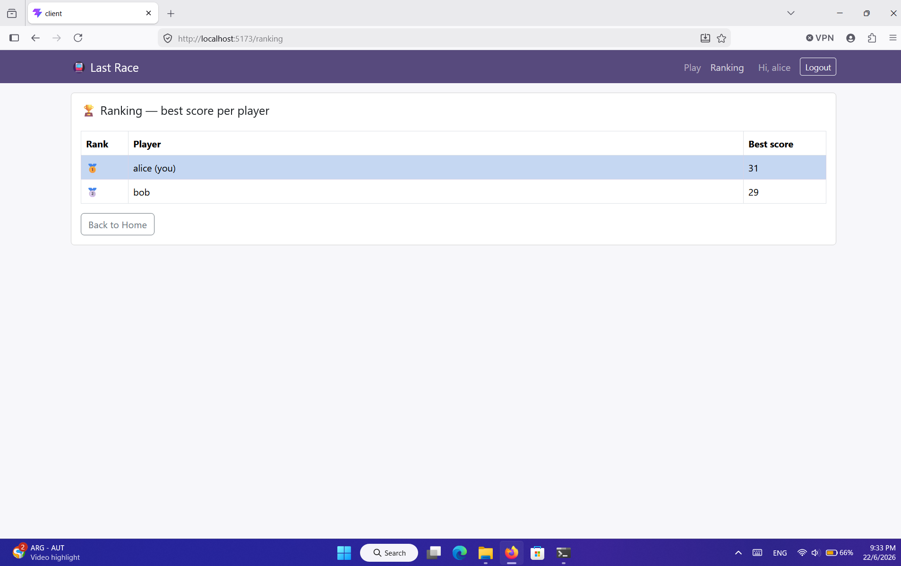
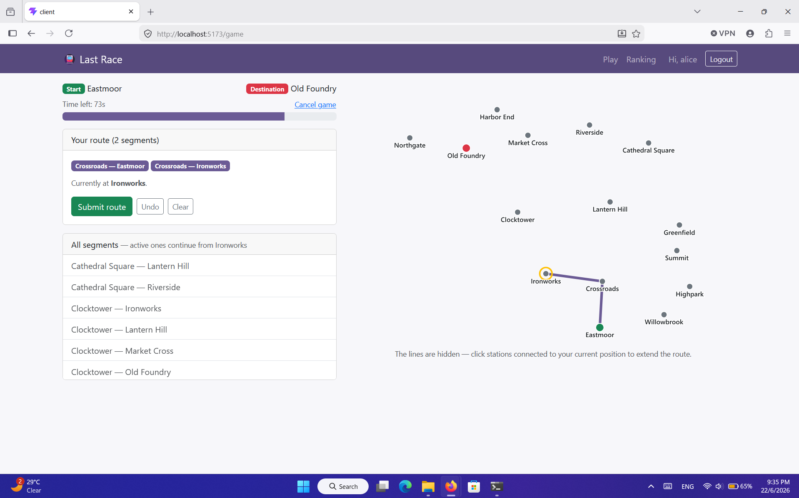

# Exam #1: "Last Race"

## Student: s357996 Kalantari Yashar

## Overview

"Last Race" is a single-player web game set on a fictional underground network. Each
game assigns the player a random start and destination station (always at least three
stops apart). During a 90-second planning phase the lines are hidden, so the player must
reconstruct the network from a flat list of segments and build a valid route. The route
is then executed one leg at a time, where random events add or remove coins; the goal is
to reach the destination with as many of the starting 20 coins as possible.

## React Client Application Routes

- Route `/`: home and game instructions, visible to everyone. Logged-in users see a
  "Play" button; the network map is never shown to anonymous visitors.
- Route `/login`: the login form for registered users.
- Route `/game`: the game itself, cycling through the Setup, Planning, Execution and
  Result phases. Requires login.
- Route `/ranking`: a table of the best score per player. Requires login.
- Any other path redirects to `/`.

## API Server

- POST `/api/sessions`: log in. Request body `{username, password}`. Response: the user
  `{id, username}`, or 401 on wrong credentials.
- GET `/api/sessions/current`: return the currently logged-in user `{id, username}`, or
  401 if nobody is logged in.
- DELETE `/api/sessions/current`: log out the current user.
- GET `/api/network` (auth): the full network for the Setup map. Response
  `{stations, lines, segments}`, where each segment includes its `line_id`.
- POST `/api/games` (auth): start a game. The server picks a random start and a
  destination at shortest-path distance ≥ 3 (BFS) and stores the assignment in the
  session. Response `{start, destination, stations, segments}`, where segments are bare
  pairs with no line information.
- POST `/api/games/current/route` (auth): submit the built route. Request body
  `{route: [{station1_id, station2_id}, ...]}` in order. The server validates and scores
  it, persists the finished game, and returns `{valid, steps, finalScore, reason?}`.
- GET `/api/ranking` (auth): best score per player, highest first. Response
  `[{username, best}, ...]`.

## Database Tables

- Table `users` - registered accounts: username, pbkdf2 password hash, and per-user salt.
- Table `stations` - the metro stations (`id`, `name`).
- Table `lines` - the metro lines (`id`, `name`, `color`).
- Table `segments` - the network topology: one row per connection,
  `(station1_id, station2_id, line_id)`.
- Table `events` - the random events, each a description and a coin effect from -4 to +4.
- Table `games` - finished games (`user_id`, start, destination, `score`, `played_at`);
  the ranking is computed from this table.

## Main React Components

- `App` (in `App.jsx`): sets up routing, the auth context provider, and the page layout.
- `AuthContext` (in `contexts/AuthContext.jsx`): holds the logged-in user and the
  login/logout actions; restores the session on startup.
- `NavHeader` (in `components/NavHeader.jsx`): the top navigation bar.
- `HomePage` (in `pages/HomePage.jsx`): instructions and landing page.
- `LoginPage` (in `pages/LoginPage.jsx`): the login form.
- `GamePage` (in `pages/GamePage.jsx`): orchestrates the Setup → Planning → Execution →
  Result phases of a game.
- `NetworkMap` (in `components/NetworkMap.jsx`): the SVG network map (all lines shown in
  Setup; clickable stations with lines hidden in Planning).
- `PlanningBoard` (in `components/PlanningBoard.jsx`): the 90-second timer and the
  continuous route builder.
- `ExecutionView` (in `components/ExecutionView.jsx`): reveals the journey one step at a
  time, then shows the final score.
- `RankingPage` (in `pages/RankingPage.jsx`): the best-score ranking table.

(All calls to the backend are centralized in `API.js`.)

## Screenshots

### General ranking page

### During a game (Planning phase)

## Users Credentials

- `alice` / `alicepass` — has already played games (appears in the ranking)
- `bob` / `bobpass` — has already played games (appears in the ranking)
- `carol` / `carolpass` — registered but has not played yet

## Use of AI Tools

I used an AI assistant (Claude) during development. It helped scaffold the project and
produce initial implementations of the Express API, the SQLite schema and seed script,
the server-side route-validation, BFS and scoring logic, and the React components, and it
helped explain concepts (Passport sessions, CORS, BFS, React hooks and Strict Mode) and
debug issues — for example a timer effect that misbehaved under Strict Mode and an
out-of-order route-selection bug. I reviewed, tested and adapted all generated code: I ran
the application end-to-end, checked the API behaviour and the validation rules against the
specification, fixed and re-tested the issues I found, and made sure I understand the
design decisions and can explain the code.